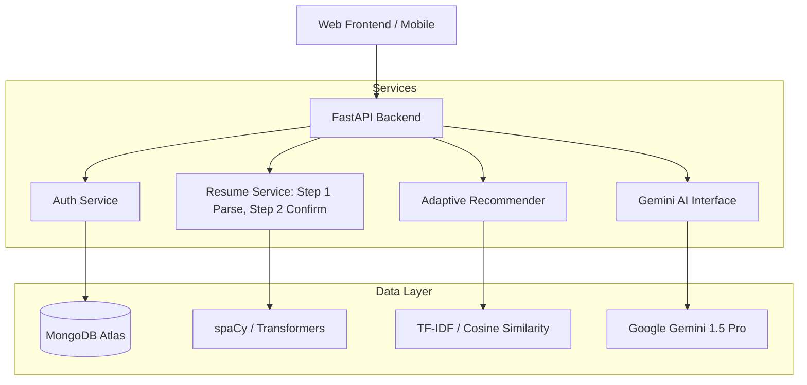

# System Design & Architecture — AIRE v2.3.0

## 1. High-Level Architecture
AIRE is built on a service-oriented backend architecture using **FastAPI** for high-performance async operations and **MongoDB** for flexible, schema-less user profiling.

## 2. Core Modules

### 2.1 Adaptive Recommendation Engine
The engine uses a **Hybrid Scoring System**:
1.  **Semantic Layer (70%)**: TF-IDF Vectorization of user skills vs. internship descriptions.
2.  **Behavioral Layer (Dynamic)**: Adjusts base scores using a "Multiplier Gradient" based on user interaction history (clicks, saves, skips).
3.  **Heuristic Layer (30%)**: Matches categorical preferences like Location and Industry Sector.

### 2.2 Resume Intelligence Pipeline (New)
A modular NLP pipeline designed for high-precision extraction:
- **Text Layer**: Uses `pdfminer.six` and `python-docx` for robust stream extraction.
- **NER Layer**: `spacy-transformers` handles entity identification (Name, Companies, Dates).
- **Semantic Normalization**: Uses `SentenceTransformer (all-MiniLM-L6-v2)` for mapping raw resume text to a canonical skill database.
- **Merge Logic**: The **HPIS (Hybrid Profile Integration System)** ensures that manual user entries are authoritative, while new data from resumes is merged or appended safely.

### 2.3 Generative Learning Service
Integrates directly with **Google Gemini Pro** to transform discovered "Skill Gaps" into 4-week structured roadmaps. The service handles prompt engineering to ensure roadmaps are specific, achievable, and localized to the user's preferred language.

## 3. Data Strategy

### 3.1 User Profiling
User profiles are stored as rich documents in MongoDB. 
- **Authoritative Data**: Manual form entries.
- **Latent Data**: Weighted sector/skill preferences derived from interactions.
- **AI-Extracted Data**: Normalized attributes from resumes.

### 3.2 Security Implementation
- **JWT Authentication**: Short-lived tokens with role-based access control.
- **Rate Limiting**: IP-based throttling on sensitive endpoints (Login, Resume Upload).
- **Environment Isolation**: Secure configuration management for DB URIs and API keys.

## 4. Scalability & Performance
- **Asynchronous Processing**: All I/O bound operations (DB, AI APIs) use Python `asyncio`.
- **Pre-computed Vectors**: TF-IDF matrices are fitted at startup to ensure sub-second recommendation response times.
- **Lazy Loading**: Heavy NLP models (Transformers) are loaded on demand to optimize memory footprint.
